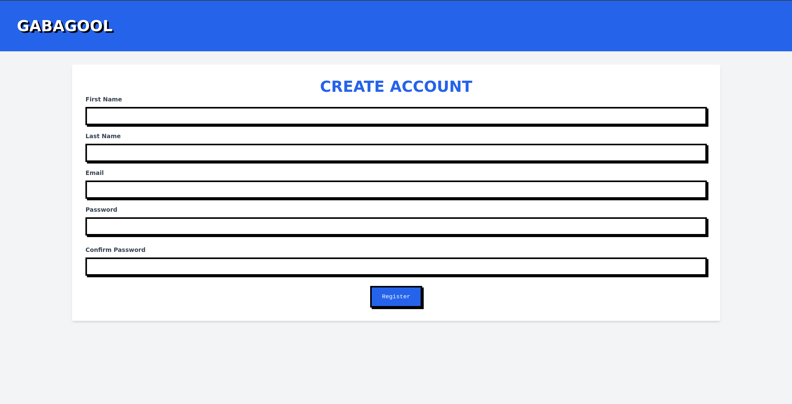
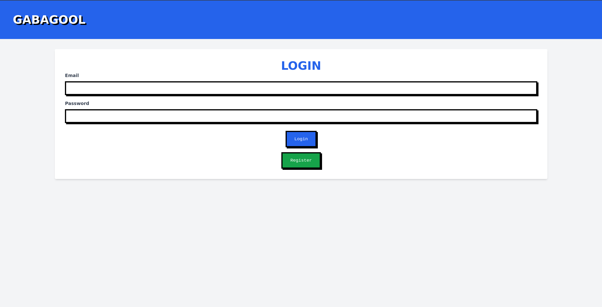
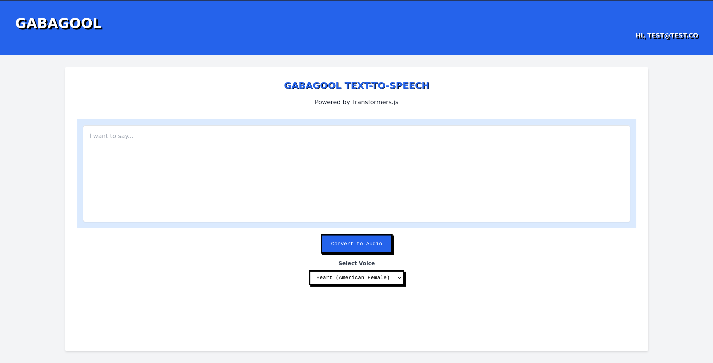

# Gabagool
Text-to-speech using [Transformers.js](https://huggingface.co/docs/transformers.js/index), [Kokoro](https://github.com/hexgrad/kokoro), and [Spring Boot](https://spring.io/projects/spring-boot).

## Overview
This is just a small project to test adding text-to-speech in browser via the Transformers.js library.
I also needed a refresher on Spring Boot, Spring Auth, and Hibernate, so it felt like a good way to combine those goals.

Overall, this is a pretty simple project with basic dependencies:
- Register an account (Spring Auth + H2)
- Login
- Play around with some high quality (and completely in-browser) text-to-speech voices.

## Demo
[Video](docs/resources/demo.mkv)
[GIF](docs/resources/demo.gif)

## Text-to-speech samples (From Hugging Face)
Voice: [Heart](https://cdn-uploads.huggingface.co/production/uploads/61b253b7ac5ecaae3d1efe0c/S_9tkA75BT_QHKOzSX6S-.wav) 
Voice: [Bella](https://cdn-uploads.huggingface.co/production/uploads/61b253b7ac5ecaae3d1efe0c/sWN0rnKU6TlLsVdGqRktF.wav) 
Voice: [Fenrir](https://cdn-uploads.huggingface.co/production/uploads/61b253b7ac5ecaae3d1efe0c/c0R9caBdBiNjGUUalI_DQ.wav)

## The Very Basic App

## Setup
1. Clone the project.
2. Navigate to project root.
3. Download dependencies: `./mvnw clean install`.
4. Run the app: `./mvnw spring-boot:run`.
5. Navigate to [the app](http://localhost:8080).
6. Register an account.
7. Login.
8. Play some voices. Note: the underlying Transformers.js library does sometimes have problems on non-Firefox browsers.

## Additional Notes
- I did not train the underlying Kokoro.js TTS model
- I had to make slight modifications to the Kokoro.js npm library, this comes bundled with a custom Kokoro build for that reason.
- Thanks for taking a look at this very tiny project!
